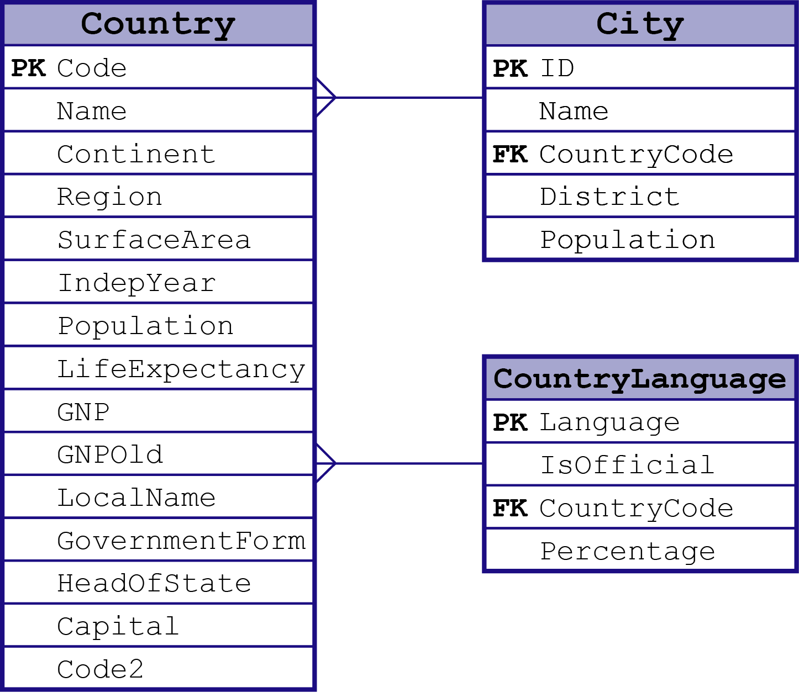
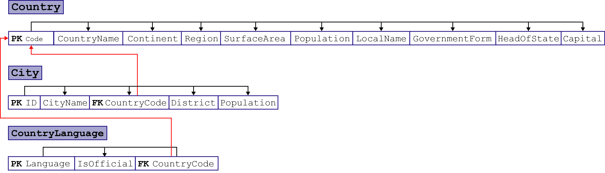

# World Record Database

## Database Source

This Database is all about the records of all the country in the World. From the local dialect to the National laguage of each country and also all the cities and which District it belongs and its population. This database has the information of the country such as Continent, Region, Surface Area, Government Form and Head of State.I get this Database from a website in the internet and I find it unique because some of the database that I found was all about employee and this one is a lot different from others.

* Table Names and Description
  1. Country - this table shows all the country in the world and its additional details.
  2. City - shows all the city in every country in the table "Country".
  3. countrylanguage - showing all the language and dialect of all the country.

## Database Dependency Diagram

This Diagram shows the dependency of each column in every table in this database.

## Complex Queries

#### Query 1
* 
    1.    This query shows the official language of all the country.
    2.    It is important to know the official language of each country in the database.
    3.    [Query and Sample Output](/sample/query.md/#Query-1)

#### Query 2
* 
    1.    This query shows all the cities from a specific country.
    2.    It is important so that you'll see what are the cities in a country.
    3.    [Query and Sample Output](/sample/query.md/#Query-2)

#### Query 3
* 
    1.    This query counts how many regions are listed in the Database.
    2.    This query is important because it can count unique value in a table.
    3.    [Query and Sample Output](/sample/query.md/#Query-3)

#### Query 4
* 
    1.    This query shows the top 10 country with biggest population.
    2.    This query can help determine what countries is the most populated.
    3.    [Query and Sample Output](/sample/query.md/#Query-4)
    
#### Query 5
* 
    1.    This query shows how many language in each country has.
    2.    This query can count how many language in each country.
    3.    [Query and Sample Output](/sample/query.md/#Query-5)
    
#### Query 6
* 
    1.    This query shows the second country with biggest Surface Area.
    2.    This query can determine the ranking of countries in terms of Surface Area.
    3.    [Query and Sample Output](/sample/query.md/#Query-6)
    
#### Query 7
* 
    1.    This query will show the country with smallest Surface Area
    2.    This query can show you the smallest value in a column.
    3.    [Query and Sample Output](/sample/query.md/#Query-7)
    
#### Query 8
* 
    1.    This query shows 20 countries with their information in a single column.
    2.    This query helps you to combine all the informations in a single column.
    3.    [Query and Sample Output](/sample/query.md/#Query-8)
    
#### Query 9
* 
    1.    This query display the ranking of each city in every country with the number of population.
    2.    This query can determine which city is more populated in every country.
    3.    [Query and Sample Output](/sample/query.md/#Query-9)
   
#### Query 10
* 
    1.    This query determine if the population of the city is less than or greater than 500,000
    2.    This query helps to segregate the values in a column in a condition you want.
    3.    [Query and Sample Output](/sample/query.md/#Query-10)

#### Query 11
* 
    1.    This query shows how many countries belongs to a certain region.
    2.    This query helps to count a specific value that has similarities.
    3.    [Query and Sample Output](/sample/query.md/#Query-11)

#### Query 12
* 
    1.    This query determine what countries has a Null value in the HeadOfState.
    2.    This query can find what columns has a Null value.
    3.    [Query and Sample Output](/sample/query.md/#Query-12)
    
#### Query 13
* 
    1.    This query displays the countries that starts with letter "A".
    2.    This query can help you search for a specific column using a keyword. 
    3.    [Query and Sample Output](/sample/query.md/#Query-13)

#### Query 14
* 
    1.    This query displays all the column from two different tables.
    2.    This query combines two specific tables. 
    3.    [Query and Sample Output](/sample/query.md/#Query-14)
    
#### Query 15
* 
    1.    This query shows the total count of all the unique values in a column.
    2.    This query can show you how to use SUM and COUNT, and how useful it is.
    3.    [Query and Sample Output](/sample/query.md/#Query-15)

#### Query 16
* 
    1.    This query calculates the total average of population in every city in a country.
    2.    This query can give you average count in a column.
    3.    [Query and Sample Output](/sample/query.md/#Query-16)

#### Query 17
* 
    1.    This query shows all the cities in the Asia.
    2.    This query can find values without using primary keys.
    3.    [Query and Sample Output](/sample/query.md/#Query-17)

#### Query 18
* 
    1.    This query updates a single column in a table.
    2.    This query gives you access to update a specific column.
    3.    [Query and Sample Output](/sample/query.md/#Query-18)

#### Query 19
* 
    1.    This query displays how many cities in every country.
    2.    This query can help you count a values in two different table.
    3.    [Query and Sample Output](/sample/query.md/#Query-19)

#### Query 20
* 
    1.    This query displays how many language in the world and how many is official and not.
    2.    This query can help you count a specific value in a column.
    3.    [Query and Sample Output](/sample/query.md/#Query-20)
