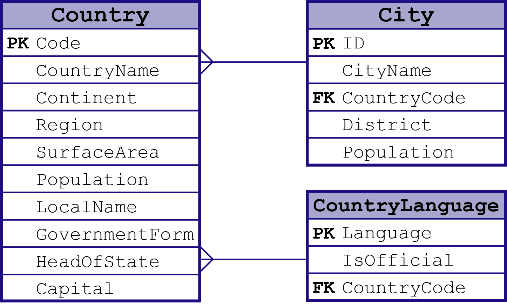

# World Record Database

# Database Source

This Database is all about the records of all the country in the World. From the local dialect to the National laguage of each country and also all the cities and which District it belongs and its population. This database has the information of the country such as Continent, Region, Surface Area, Government Form and Head of State.I get this Database from a website in the internet and I find it unique because some of the database that I found was all about employee and this one is a lot different from others.

* Table Names and Description
  1. Country - this table shows all the country in the world and its additional details.
  2. City - shows all the city in every country in the table "Country".
  3. countrylanguage - showing all the language and dialect of all the country.

# Database Dependency Diagram

